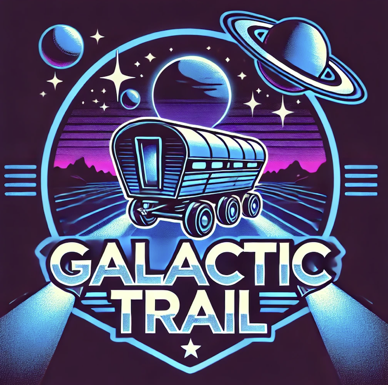

# Project_08

## Name
Galactic Trail

## Description
Text-only version of Oregon Trail that does a spin on the original game. This time it takes place in space; there are also some additions from the original game. Otherwise, it has the same general idea as the original game.

The game includes Ships, Crew, Morale, Planets, Events, and resources. 
You can and often will lose crew, resources, and morale during events. 

## Installation/Running
Impossible for the public as of now, as we use a CSL VM for the MySQL server.

For us:

Make sure Java 17+ is installed

Download source code from repository, extract it

Download [Java database connector jar file (version 9.2.0)](https://dev.mysql.com/downloads/connector/j/?os=26), put in CODE folder

Open command shell, cd into Project_08 directory and do:
ssh -L localhost:60000:localhost:60000 CSLUSERNAME@cs506x08.cs.wisc.edu
(this allows you to connect to the VM with the MySQL server)

Make sure Docker Desktop is running

Open run_game.bat file in the CODE folder (run_game.sh for Mac/Linux)

Enjoy!

Note: When prompted for a store tutorial, input "dev" to skip past the shop and give yourself infinite stuff.

## Visuals

## Program architecture
Our game runs as a .sh/.bat file that opens a command shell, through which the game is interacted with (this is a CLI game). This then starts the Docker container, which runs the code of our project. The frontend and backend are both written in Java, but the backend connects to a MySQL database hosted on a CSL VM machine.
Program Frontend and Backend in Java, also include Database to be programmed in SQL. 

The frontend displays the output on the command shell, and also receives the inputs from the command line.

We decided on our main codebase being Java because we all know it, and because this class seems geared towards Java development. The Docker container and CSL VM MySQL server were project requirements, and we decided to go with a CLI game for our retro game project because we like The Oregon Trail and wanted to do something similar. 

## Authors and acknowledgment
Frontend - Will, Dan
Backend/Database - Steven, Sanjay, Arnie, James

## Project status

Sprint 1:
Backend work consists of the Planet, Event, and Player class (With their respective tester methods). The general classes (Event, Class) are finished. 
Docker work is progressing fast and SQL work is finished an represented in our EventConnector class which shows the intial steps of connecting our SQL database in the VM to our local code.
Integrating SQL plus Event class is a significant milestone the group aims to show off in the demo for Sprint 1.

Sprint 2:
For Sprint 2, we made the game functional and got our program architecture settled. First off, we added a store to the game, wherein you can buy the resources you need to survive (including crewmates). After that, we started integrating the frontend and backend to work together. We then made adjustments to the .bat/.sh files to fix up the Docker container and make it run smoothly. 

We fleshed out the planets, putting them in a .csv file, as the SQL database is really tedious and we only had a few pre-defined planets we needed to add. Then, we started integrating the events into the frontend (no database integration yet). After this, we decided to scale back the scope of our Player class a bit and removed the Ship and Crewmate subclasses (the Ship class would later become its own class). We also realized at this time that we absolutely had to use the CSL VM for the SQL database, so we took out the Docker file code for a MySQL container and decided we would just set it up on the VM and connect to it there to avoid having to manage multiple MySQL databases. Then, we added the functionality to travel to the next planet and survival mechanics, setting everything up to make our first functional demo. After that, we finally fully integrated the events into the game, the holdup being the MySQL server on the VM being very difficult to configure and connect to. 

We then decided to start cleaning up our code, as the core gameplay was taking shape and we mostly knew what we wanted by now. We also implemented ship fuel/pacing + a tutorial into the game, which were on the backburner for a while. 

Sprint 3:
As of Sprint 3, we're starting to focus more and more on documentation and making sure our code is up to snuff and not a bunch of spaghetti. We started deleting unused code last sprint, and this sprint we even split off the frontend into multiple classes. We have a few features in the backlog still, like an easy/hard mode, a full tutorial, and mystery events, but most functionality is in the game now and what we're adding won't affect the core gameplay much. We're also probably going to be adding more events, for more gameplay flavor.
As of the end of Sprint 3, we've also added a sage NPC, event graphics, individual crew members, improved the UI, and made our first stable release.