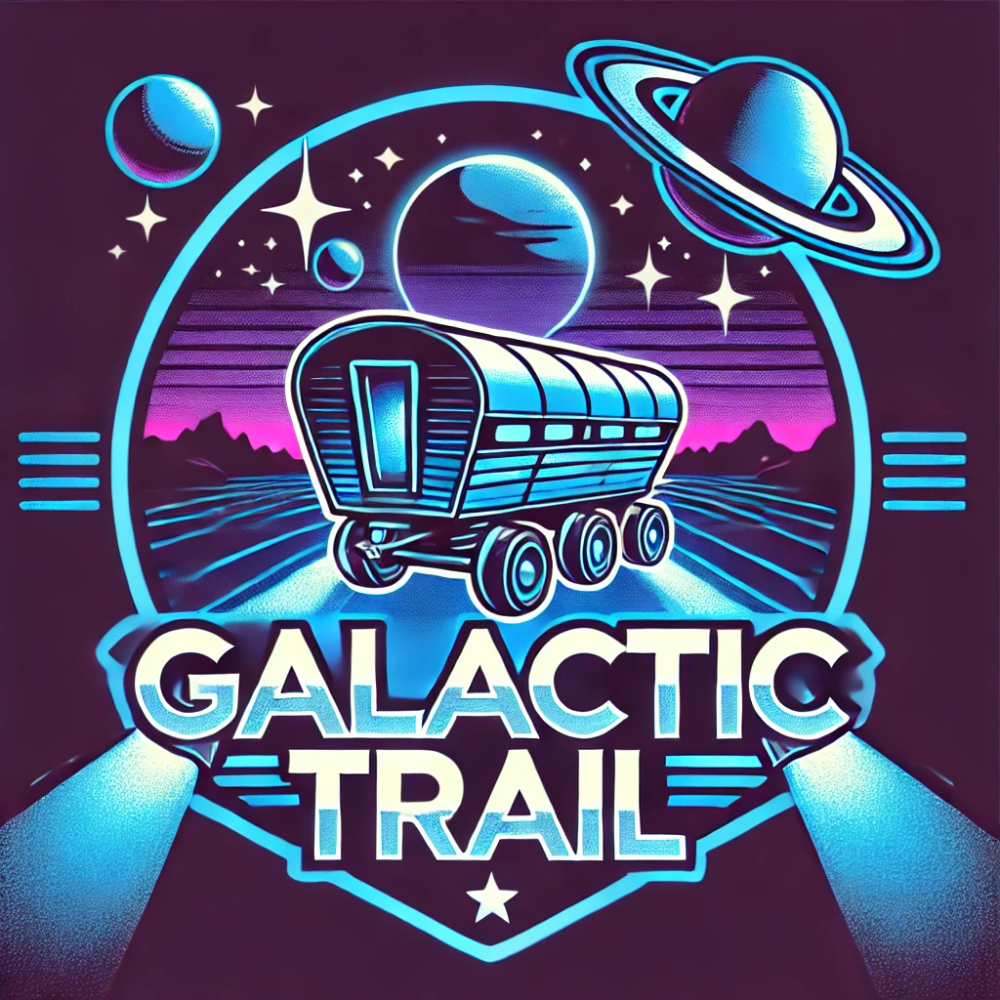

# Project_08

## Name
Galactic Trail

## Description
Text only version of Oregon Trail that does a spin on the original game. This time it takes place in space, there are also some additions
from the original game. Otherwise it has the same general idea as the original game

## Installation
Unknown at the moment

## Visuals

## Roadmap
Program Frontend and Backend in Java, also include Database to be programmed in SQL. 

Project Roadmap will evolve as the project momentum increases

## Authors and acknowledgment
Frontend - Will, Dan
Backend - Steven, Sanja, Arnie
Database - James

## Project status

We have just started this project
